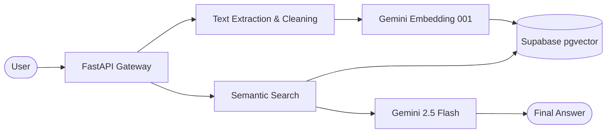

# 🚀 RAG Pipeline Pro: Production-Grade Document Intelligence

A high-performance, **cloud-persistent** Retrieval-Augmented Generation (RAG) pipeline. Built with **FastAPI**, **Gemini 2.5 Flash**, and **Supabase (pgvector)**, this system allows you to upload PDFs and query them with absolute accuracy.

---

## ✨ Features

- 🧠 **Gemini 2.5 Flash Intelligence**: Leverages Google's latest high-speed reasoning model for precise answers.
- 📂 **Cloud Persistence**: Unlike standard RAG demos, all your documents and vectors are stored permanently in **Supabase Cloud**.
- 🛠️ **Advanced Text Healing**: Includes a recursive cleaning engine to fix messy PDF extractions and "spaced-out" characters.
- ⚡ **Auto-Retry Architecture**: Built-in exponential backoff to handle API rate limits gracefully on the free tier.
- 🔍 **Vector Search**: High-speed HNSW indexing via `pgvector` for instant retrieval across large datasets.
- 🐳 **Docker Optimized**: Fully containerized for one-click deployment to Hugging Face Spaces.

---

## 🏗️ System Architecture

---

## 🚀 Quick Start

### 1. Prerequisites
- **Google AI Studio API Key** (Gemini)
- **Supabase Project** (with `pgvector` enabled)

### 2. Environment Variables
Configure the following secrets in your Hugging Face Space:
| Variable | Description |
| :--- | :--- |
| `GOOGLE_GEMINI_API_KEY` | Your Gemini API Key from Google AI Studio |
| `DB_URL` | Your Supabase **Transaction Pooler** URL (Port 6543) |

### 3. Usage
- **Upload**: `POST /upload` - Send a PDF for processing.
- **Query**: `POST /query` - Ask questions about your documents.
- **Health**: `GET /health` - Check system status and version.

---

## 🛠️ Tech Stack

- **Framework**: FastAPI
- **LLM / Embeddings**: Google Generative AI (Gemini 2.5 Flash)
- **Vector Database**: Supabase (PostgreSQL + pgvector)
- **PDF Engine**: pypdf + Custom Text Healer
- **Deployment**: Docker on Hugging Face Spaces

---

## 📄 License
This project is licensed under the MIT License - see the [LICENSE](LICENSE) file for details.

---

  Built with ❤️ for the AI Developer Community.  
  <b>Version 3.0-Final (Stable)</b>

